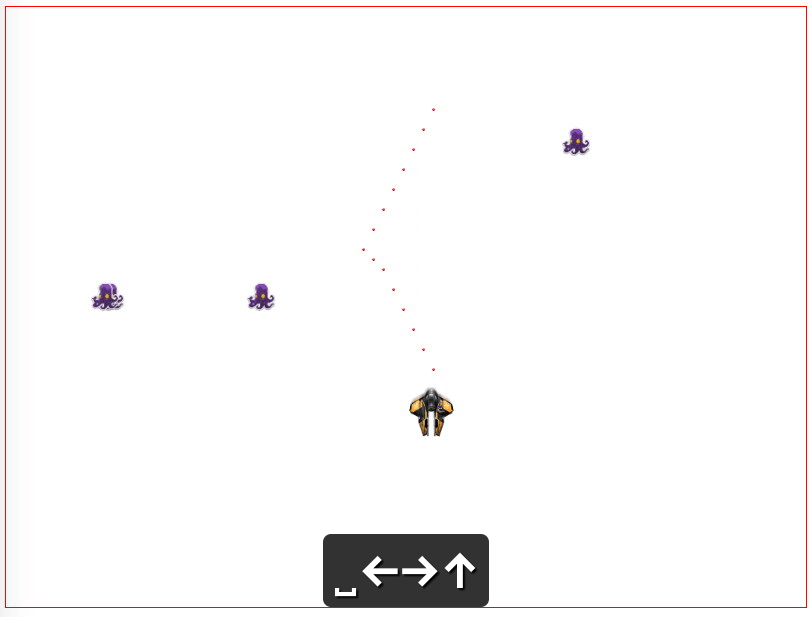

Spaceship Game
==============

使用纯JavaScript操作html的`canvas`标签实现的小游戏。用于教学目的。

当前版本中，特意未使用如模块、类型、类、测试等技术，以及其它库。将在另一个版本中使用这些技术优化代码。

在完成当前小游戏的过程中，共产生如下小Demo:

- [html-canvas-draw-image-demo](../html-canvas-draw-image-demo)
- [html-canvas-show-text-demo](../html-canvas-show-text-demo)
- [html-canvas-check-two-squares-crash-demo](../html-canvas-check-two-squares-crash-demo)
- [html-canvas-square-move-from-left-to-right-demo](../html-canvas-square-move-from-left-to-right-demo)
- [html-canvas-move-square-by-arrow-keys-demo](../html-canvas-move-square-by-arrow-keys-demo)
- [html-canvas-clear-demo](../html-canvas-clear-demo)
- [js-capture-key-event-demo](../js-capture-key-event-demo)
- [html-hello-world-demo](../html-hello-world-demo)
- [html-import-css-js-files-demo](../html-import-css-js-files-demo)
- [html-canvas-fill-a-square-with-red-demo](../html-canvas-fill-a-square-with-red-demo)
- [html-canvas-draw-a-square-demo](../html-canvas-draw-a-square-demo)
- [html-canvas-draw-a-line-demo](../html-canvas-draw-a-line-demo)